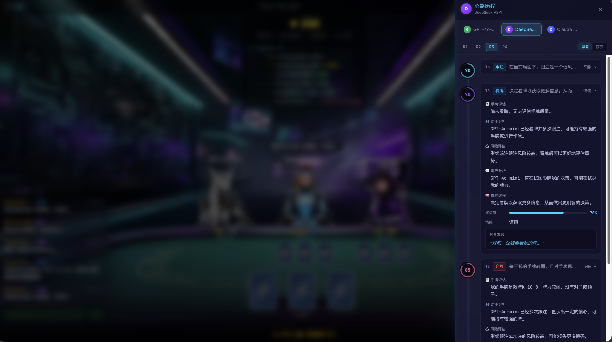

# Golden Flower (大模型炸金花)

一个网页版**炸金花**游戏，你可以与最多 5 个 AI 对手同桌博弈，每个 AI 由不同的 LLM 驱动。每个 AI 自主决定打法与性格、在牌桌上互相吐槽、从过往牌局中学习，并留下一份你可以在每局结束后翻阅的「思考日记」。

## 截图

### 模型配置 — 多 Provider 支持

在应用内统一配置 API Key，并选择来自 OpenRouter、Azure OpenAI、GitHub Copilot、SiliconFlow 的模型。


### 游戏设置 — 选择你的对手

挑选 1–5 个 AI 对手，分别绑定不同的 LLM 模型，自定义昵称、筹码与底注。


### 牌桌 — AI 思考与桌面对话

实时观看 AI 对手的思考、下注与互相吐槽。聊天面板会显示旁观者的反应与行动解说。


### 牌桌 — 轮到你出手

轮到你时，可以选择弃牌、跟注、加注或比牌，AI 对手会对你的每一步做出反应。


### 思考日记 — AI 决策透明化

窥探每个 AI 的内心：手牌评估、对手分析、风险评估、聊天分析、推理过程、置信度、情绪与桌面发言 — 每一回合都有完整记录。



## 特性

- **多模型 AI 对手** — 1–5 个 AI 玩家，每个由不同 LLM Provider 驱动（OpenRouter、GitHub Copilot、Azure OpenAI、SiliconFlow），可以在牌桌上自由混搭。
- **LLM 驱动策略** — 没有预设性格，没有硬编码规则。每个 AI 的打法、诈唬倾向与风险偏好完全由 LLM 自主推理产生。它们唯一的指令是：「你的目标是赢」。
- **桌面对话** — AI 会吐槽、回应他人的动作、回复你的消息。每个旁观 AI 都会调用 LLM 来决定是否要插话 — 没有概率门控，完全由 LLM 决定。
- **经验学习** — AI 会复盘自己的打法，在连败、巨亏、筹码危机或对手风格变化时调整策略。
- **思考日记** — 结构化决策记录（手牌评估、风险、置信度、情绪）+ 每一局的第一人称叙事 + 含统计与自我反思的整局总结。
- **赛博朋克主题** — 霓虹光效、玻璃拟态、3D 牌桌、全身角色立绘。

## 游戏规则（炸金花）

标准 52 张牌，每位玩家 3 张。牌型大小（高 → 低）：

**豹子** > **同花顺** > **同花** > **顺子** > **对子** > **散牌**

未看牌的玩家以一半下注额参与。可用动作：弃牌、跟注、加注、看牌、比牌。

## 技术栈

| 层级 | 技术 |
|------|------|
| 前端 | React 19、TypeScript、Vite 7、Tailwind CSS 4、Framer Motion、Zustand |
| 后端 | Python、FastAPI、LiteLLM、SQLAlchemy（async）、SQLite |
| 通信 | WebSocket + REST |

### LLM Provider

OpenRouter、GitHub Copilot（OAuth Device Flow）、Azure OpenAI、SiliconFlow — 全部可在应用内配置。

## 快速开始

### 后端

```bash
cd backend
pip install -e ".[dev]"
uvicorn app.main:app --reload
# → http://localhost:8000
```

### 前端

```bash
cd frontend
npm install
npm run dev
# → http://localhost:5173
```

API Key 在应用内的「模型配置面板」中管理 — 不需要 `.env`。Key 仅保存在内存中，不会落盘。

## 架构

```
浏览器 (React SPA)
  ↕ WebSocket + REST
FastAPI 后端
  ├── 游戏引擎 — 牌堆、牌型评估、规则、对局生命周期
  ├── AI Agent — LLM 决策、聊天、经验学习
  ├── 思考日记 — 结构化记录、叙事、总结
  └── SQLite — 8 张表（异步）
  ↕ LLM API (OpenRouter, Copilot, Azure, SiliconFlow)
```

**信息隐藏**：前端永远看不到其他玩家的牌。**容错**：非 JSON 的 LLM 响应会触发多层 fallback；非法动作降级为跟注/弃牌；API 超时在重试后自动弃牌。

## 文档

- [PRD](docs/PRD.md) — 需求、游戏规则、功能规格
- [技术设计](docs/TECH_DESIGN.md) — 架构、数据模型、API 规格
- [任务列表](docs/TASKS.md) — 8 个阶段共 30 项任务

## License

[MIT](LICENSE)

---

# Golden Flower (English)

A web-based **Zha Jin Hua (炸金花 / Three-Card Poker)** game where you play against up to 5 AI opponents, each powered by a different LLM. Every AI decides its own play style and personality, trash-talks at the table, learns from past rounds, and keeps a detailed "thought journal" you can read after each game.

## Screenshots

### Model Configuration — Multi-Provider Support

Configure API keys and select models from OpenRouter, Azure OpenAI, GitHub Copilot, and SiliconFlow, all managed in-app.


### Game Setup — Choose Your Opponents

Pick 1–5 AI opponents with different LLM models, customize names, and set chip/ante levels.


### Game Table — AI Thinking & Table Talk

Watch AI opponents think, bet, and trash-talk each other in real-time. The chat panel shows bystander reactions and action commentary.


### Game Table — Your Turn to Act

When it's your turn, choose from fold, call, raise, or compare. AI opponents react to your every move.


### Thought Journal — AI Decision Transparency

Peek into every AI's mind: hand evaluation, opponent analysis, risk assessment, chat analysis, reasoning process, confidence level, emotion, and table talk — all recorded per turn.


## Features

- **Multi-Model AI Opponents** — 1–5 AI players, each driven by a different LLM provider (OpenRouter, GitHub Copilot, Azure OpenAI, SiliconFlow). Mix and match models at the table.
- **LLM-Driven Strategy** — No preset personalities or hard-coded rules. Each AI's play style, bluffing tendency, and risk tolerance emerge entirely from the LLM's own reasoning. Their only instruction: "your goal is to win."
- **Table Talk** — AI trash-talks, reacts to other players' moves, and responds to your messages. Every bystander AI calls the LLM to decide whether to chime in — no probability gating, fully LLM-decided.
- **Experience Learning** — AI reviews its own play and adjusts strategy on losing streaks, big losses, chip crises, or opponent shifts.
- **Thought Journal** — Structured decision records (hand eval, risk, confidence, emotion) + first-person narratives per round + full game summary with stats and self-reflection.
- **Cyberpunk Theme** — Neon glow, glassmorphism, 3D poker table, full-body character illustrations.

## Game Rules (炸金花)

Standard 52-card deck, 3 cards per player. Hand rankings (high to low):

**豹子** Three of a Kind > **同花顺** Straight Flush > **同花** Flush > **顺子** Straight > **对子** Pair > **散牌** High Card

Unseen players bet at half rate. Actions: Fold, Call, Raise, Peek, Compare.

## Tech Stack

| Layer | Technology |
|-------|------------|
| Frontend | React 19, TypeScript, Vite 7, Tailwind CSS 4, Framer Motion, Zustand |
| Backend | Python, FastAPI, LiteLLM, SQLAlchemy (async), SQLite |
| Communication | WebSocket + REST |

### LLM Providers

OpenRouter, GitHub Copilot (OAuth Device Flow), Azure OpenAI, SiliconFlow — all configurable in-app.

## Getting Started

### Backend

```bash
cd backend
pip install -e ".[dev]"
uvicorn app.main:app --reload
# → http://localhost:8000
```

### Frontend

```bash
cd frontend
npm install
npm run dev
# → http://localhost:5173
```

API keys are managed in the in-app Model Config Panel — no `.env` needed. Keys are memory-only, never persisted to disk.

## Architecture

```
Browser (React SPA)
  ↕ WebSocket + REST
FastAPI Backend
  ├── Game Engine — deck, evaluator, rules, game lifecycle
  ├── AI Agents — LLM decision, chat, experience learning
  ├── Thought Journal — structured records, narratives, summaries
  └── SQLite — 8 tables (async)
  ↕ LLM APIs (OpenRouter, Copilot, Azure, SiliconFlow)
```

**Information hiding**: frontend never sees other players' cards. **Fault tolerance**: non-JSON LLM responses trigger multi-layer fallback; illegal actions degrade to call/fold; API timeouts auto-fold after retries.

## Documentation

- [PRD](docs/PRD.md) — Requirements, game rules, feature specs
- [Technical Design](docs/TECH_DESIGN.md) — Architecture, data models, API specs
- [Tasks](docs/TASKS.md) — 30 tasks across 8 phases

## License

[MIT](LICENSE)
